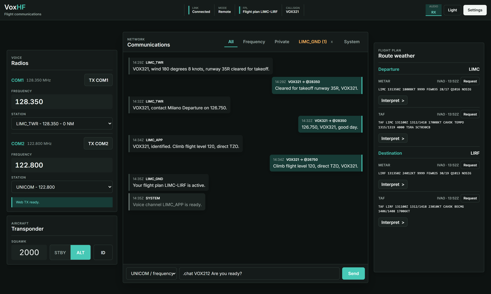
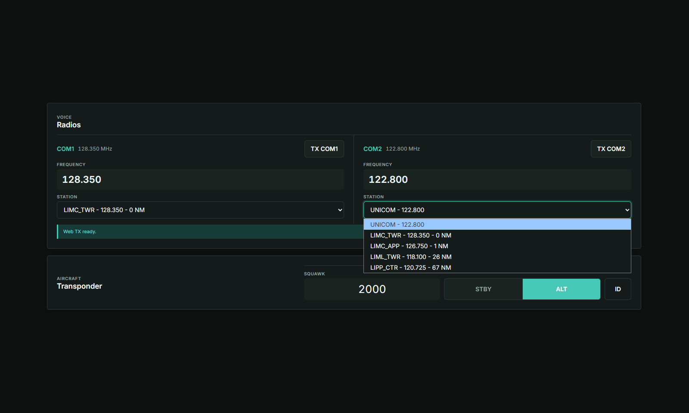
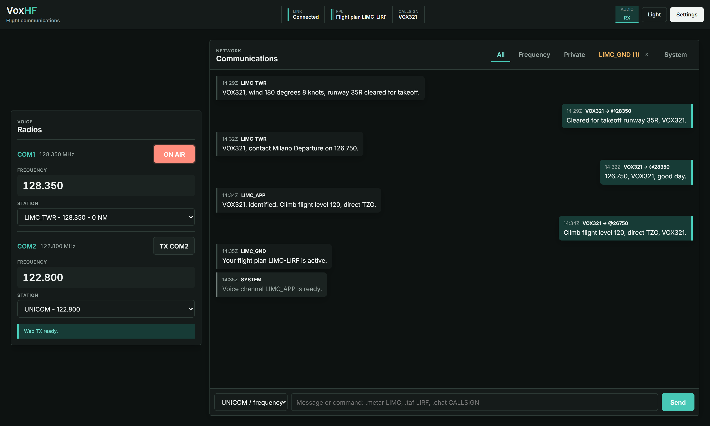
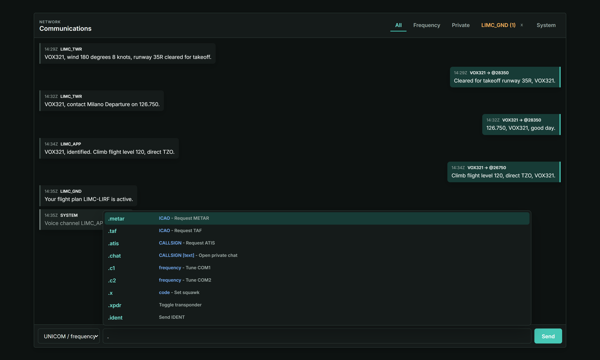
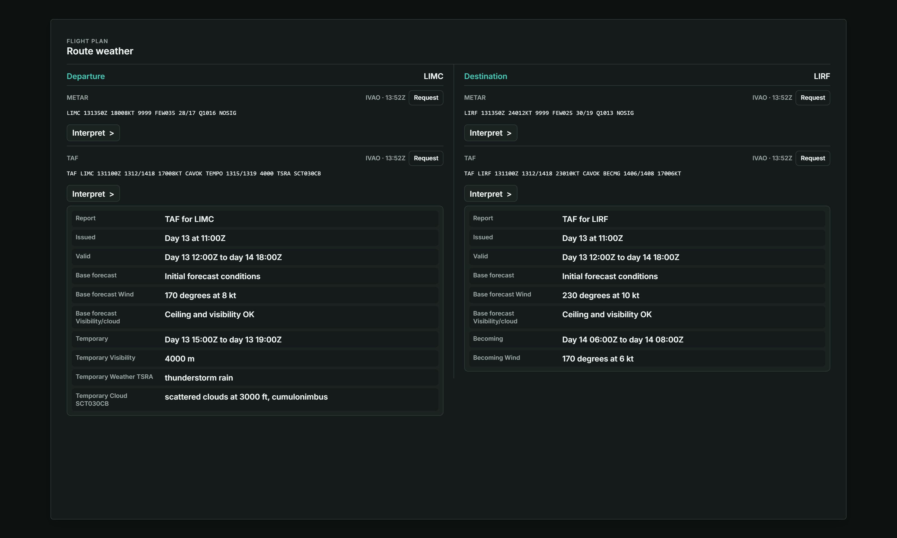
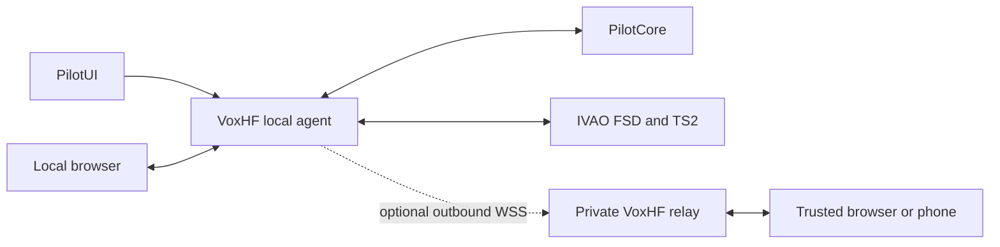

# VoxHF

**Flight communications in the browser.**

VoxHF is an open-source companion for IVAO Altitude. It puts COM radios, live
voice, transponder controls, network messages, and route weather in one browser
workspace while Altitude remains connected on the simulator PC.

> **Development status:** VoxHF is working software and is currently available
> as a public beta. Use it for responsible testing and follow IVAO rules. VoxHF
> is unofficial and is not affiliated with or endorsed by IVAO.



## What It Does

- Tunes COM1 and COM2 manually or from distance-sorted online stations.
- Keeps UNICOM `122.800` available and filters `_OBS` stations.
- Receives live IVAO voice in one or more trusted browsers.
- Transmits from a desktop or phone microphone on COM1 or COM2.
- Lets a phone act as the microphone for a simulator PC without one.
- Sends frequency, broadcast, and private messages with command completion.
- Controls squawk, STBY/ALT, and IDENT.
- Shows route METAR and TAF with optional plain-language interpretation.
- Runs locally without an account, or remotely through a private relay.

## Workspace Preview

<table>
  <tr>
    <td width="50%"><strong>Radio and transponder</strong><br></td>
    <td width="50%"><strong>Live browser voice</strong><br></td>
  </tr>
  <tr>
    <td width="50%"><strong>Messages and commands</strong><br></td>
    <td width="50%"><strong>Route weather</strong><br></td>
  </tr>
</table>

## Choose A Mode

| Mode | Best for | Account | Internet-facing component |
| --- | --- | --- | --- |
| Local | One simulator PC and browser | No | None |
| Existing server | Access from another network or phone | Yes, on that server | Trusted operator's relay |
| Self-hosted | Full control over accounts and infrastructure | Optional | Your VPS |

The [visual setup guide](https://voxhf.com/setup) explains all three paths. The
repository guides contain the same operational detail for offline use:

- [Local Installation](docs/INSTALL_LOCAL.md)
- [Connect to an existing server](docs/INSTALL_LOCAL.md#connect-to-a-remote-server)
- [Self-Hosting](docs/SELF_HOSTING.md)

## How It Works

VoxHF does not replace Altitude and the browser never connects directly to
IVAO. A local Node.js agent sits between PilotUI, PilotCore, FSD, and TS2. It
parses state, forwards local traffic, extracts RX audio, and creates TX packets.



Only parsed state, allowlisted commands, and live audio cross the optional
relay. PilotUI/PilotCore, FSD, TS2, and the local webapp ports must never be
published to the internet. See the [Technical Paper](docs/TECHNICAL_PAPER.md)
and [Threat Model](docs/THREAT_MODEL.md) for the detailed boundaries.

## Local Quick Start

### Requirements

- Windows 10 or 11
- IVAO Altitude/PilotUI and PilotCore
- [Node.js 20 or newer](https://nodejs.org/)
- ffmpeg with Speex encoding and decoding
- A current Chromium, Firefox, or Safari browser

Install the external tools with Winget when needed:

```powershell
winget install OpenJS.NodeJS.LTS
winget install Gyan.FFmpeg
```

Open a new terminal and verify:

```powershell
node --version
ffmpeg -hide_banner -encoders | findstr speex
ffmpeg -hide_banner -decoders | findstr speex
```

### Run From Source

```powershell
git clone https://github.com/leledeste/voxhf.git
cd voxhf
npm.cmd install
npm.cmd run setup
npm.cmd start
```

For a normal pilot installation, the `voxhf-local-<version>.zip` release omits
Docker, SQLite, and server administration. Git is not required.

Double-click `start.bat` before opening PilotUI. Enter the IPv4 address printed by VoxHF
as the PilotUI **Simulator Address**, connect Altitude normally, then open
[http://localhost:3000](http://localhost:3000).

## Remote Access

The local agent always stays on the Altitude PC. To reach it from another
network:

1. Use a trusted existing server or deploy your own relay.
2. Register with a one-time invite code when the server is invite-only.
3. Save the agent token shown once after registration.
4. Run `npm.cmd run setup -- agent` on the Altitude PC.
5. Enter the relay URL, token, and a recognizable device name.
6. Restart VoxHF and sign in from each trusted browser or phone.

The [server directory](https://voxhf.com/servers) is opt-in. A green heartbeat
means only that a listed server recently contacted the directory. Independent
servers can modify VoxHF and their data practices; their listing is not a
security review or endorsement. The VoxHF-operated server, when available, is
shown first and explicitly labelled.

## Privacy And Security

Default design choices:

- No voice recording.
- No persistent full chat history.
- No IVAO credentials in the browser or relay.
- Hashed account, agent, invite, recovery, and heartbeat secrets.
- HttpOnly browser sessions for account mode.
- Origin allowlists and an allowlisted remote command protocol.
- Optional audit and session metadata storage, disabled by default.

Connecting to a third-party server means trusting its operator with that
server's account data and live relayed traffic. Review its source declaration
and privacy notice before registering. Report vulnerabilities privately through
the process in [SECURITY.md](SECURITY.md).

## Project Status

Working and tested:

- Local and remote COM, XPDR, messaging, weather, RX, and TX.
- Multiple browsers connected to one pilot agent.
- Invite-only accounts, sessions, recovery, admin, and optional passkey MFA.
- SQLite backup/restore and Docker/Caddy self-hosting.
- Focused Local, Hosted Webapp, Server, and Full Source release packages.
- Opt-in server directory registry with authenticated heartbeats.

Still required before expanding beta access:

- Broader independent security review.
- GitHub code, dependency, and secret-scanning protections.
- Continued live voice regression tests across browsers, devices, and networks.
- Public-beta feedback and explicit release-candidate exit criteria.

Current protocol and platform limitations are tracked in the
[Roadmap](docs/ROADMAP.md).

## Repository Map

| Path | Purpose |
| --- | --- |
| `proxy/` | Local PilotUI, PilotCore, FSD, TS2, voice, and browser agent |
| `webapp/` | Workspace, login, landing, setup, privacy, and server directory |
| `apps/relay/` | Remote routing, accounts, admin, SQLite, and directory API |
| `packages/protocol/` | Shared validated remote message contract |
| `infra/docker/` | Caddy, Docker Compose, and VPS operations |
| `scripts/` | Setup, tests, backups, updates, and release tooling |
| `docs/` | Detailed user, operator, security, and design documentation |

## Development

```powershell
npm.cmd run verify
npm.cmd run remote:test
npm.cmd audit
```

Run `npm.cmd run site:preview` to review public pages and the demo workspace
without opening Altitude bridge ports. See [Development](docs/DEVELOPMENT.md)
for tests and diagnostics.

## Release Packages

The source tree generates four independent artifacts:

- **VoxHF Local Slim** for normal pilot PCs
- **VoxHF Hosted Webapp** for static HTTPS hosting
- **VoxHF Server** for relay, webapp, SQLite, admin, Docker, and Caddy
- **VoxHF Full Source** for contributors and auditors

```powershell
npm.cmd run release:prepare
npm.cmd run release:verify
```

Generated archives include SHA-256 checksums and are intentionally ignored by
Git. See [Release Testing](docs/RELEASE_TESTING.md).

## Documentation

Start with the [documentation index](docs/README.md), then use:

- [Roadmap](docs/ROADMAP.md)
- [Local Installation](docs/INSTALL_LOCAL.md)
- [Self-Hosting](docs/SELF_HOSTING.md)
- [Security Audit](docs/SECURITY_AUDIT.md)
- [Privacy](docs/PRIVACY.md)
- [Technical Paper](docs/TECHNICAL_PAPER.md)

## License

VoxHF is released under the [GNU Affero General Public License v3.0 only](LICENSE).
If you run a modified version over a network, you must offer its users the
corresponding source code as required by the licence.
