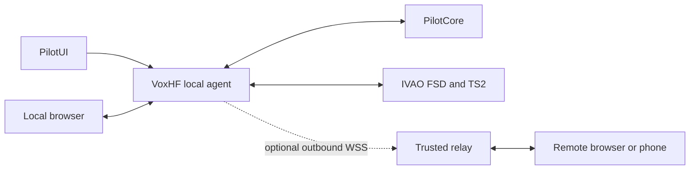

# VoxHF

**Flight communications in the browser.**

VoxHF is an open-source companion for IVAO Altitude. Altitude remains connected
on the simulator PC while VoxHF adds browser-based radios, live voice,
transponder controls, messages, route weather, notifications, and remote access.

> **Status:** public beta. VoxHF is unofficial and is not affiliated with or
> endorsed by IVAO. Use it responsibly and follow IVAO rules.


## Features

- COM1 and COM2 tuning, distance-sorted online stations, and permanent UNICOM
  `122.800` access.
- Live TS2 ATC RX and browser-microphone TX on desktop and mobile devices;
  official Voice UNICOM is not yet supported.
- Frequency, broadcast, and private messages with command completion.
- For you filtering and amber callsign highlights, page-only unsent drafts,
  and browser-saved tab ordering/visibility with non-destructive close.
- A compact browser RX mute control, independent of TX and notifications.
- Squawk, STBY/ALT, and IDENT controls.
- Flight-plan departure/destination plus METAR, TAF, ATIS requests, route
  weather, and optional plain-language weather interpretation.
- Recent chat recovery across browsers for the lifetime of the local proxy.
- Per-device Web Push for private messages, callsign-addressed public messages,
  IVAO disconnects, an optional online confirmation, a three-minute timer, and
  an optional remote PC/proxy offline alert.
- Local-only use without an account or remote use through a trusted relay.

See the [User Guide](docs/USER_GUIDE.md) for every control, notification rule,
command, example, and mobile-specific behavior.

## Choose A Mode

| Mode | Use it when | What is internet-facing |
| --- | --- | --- |
| Local | The browser and Altitude are on the simulator PC or local network. | Nothing. No account is required. |
| Existing server | You want to use a phone, tablet, or another network. | A trusted operator's HTTPS/WSS relay. |
| Self-hosted | You want to operate the webapp, relay, accounts, and admin panel. | Your VPS on ports 80/443. |

- [Install the Local agent](docs/INSTALL_LOCAL.md)
- [Use VoxHF](docs/USER_GUIDE.md)
- [Install a self-hosted server](docs/SELF_HOSTING.md)

The visual setup page is also available at [voxhf.com/setup](https://voxhf.com/setup).

## Local Quick Start

Requirements: Windows 10/11, IVAO Altitude, Node.js 24 or newer (24 LTS recommended), and ffmpeg
with Speex support.

```powershell
winget install OpenJS.NodeJS.LTS
winget install Gyan.FFmpeg
```

Download `voxhf-local-<version>.zip` from the latest release, extract the whole
archive to a user folder, and double-click `start.bat`. Enter the IPv4 address
printed by VoxHF as PilotUI's **Simulator Address**, connect Altitude, then open
[http://localhost:3000](http://localhost:3000).

The complete first-run, remote-server, update, and removal procedures are in
[Local Installation](docs/INSTALL_LOCAL.md).

## How It Works

The browser never connects directly to IVAO, PilotCore, FSD, or TS2. The local
Node.js agent is the source of truth and keeps Altitude's local connections
private. Remote access is an outbound encrypted connection from that agent to
the relay.


```mermaid
flowchart LR
    UI["PilotUI"] --> Agent["VoxHF local agent"]
    Agent <--> Core["PilotCore"]
    Agent <--> IVAO["IVAO FSD and TS2"]
    Local["Local browser"] <--> Agent
    Agent -. "optional outbound WSS" .-> Relay["Trusted relay"]
    Relay <--> Remote["Remote browser or phone"]
```

Only parsed state, allowlisted commands, and live audio cross the optional
relay. Never publish local ports `4827`, `6809`, `8767`, or `3000` to the
internet. The [Technical Paper](docs/TECHNICAL_PAPER.md) documents the protocol
and trust boundaries.

## Privacy And Security

VoxHF does not record voice, store IVAO credentials, or persist full chat
history. Recent chat is bounded, memory-only, and cleared when the local proxy
stops. Relay audio and messages are routed live and are not stored in SQLite.

Connecting to someone else's server means trusting its operator with account
data and live relayed traffic. Read that deployment's privacy notice before
registering. See [Privacy](docs/PRIVACY.md), [Security](SECURITY.md), and the
[Threat Model](docs/THREAT_MODEL.md).

## Repository Map

| Path | Purpose |
| --- | --- |
| `proxy.js`, `proxy/` | Local PilotUI, PilotCore, FSD, TS2, voice, state, and browser agent |
| `webapp/` | Operational app, account pages, public site, and installable-webapp assets |
| `apps/relay/` | Authenticated relay, accounts, administration, and SQLite |
| `packages/protocol/` | Validated remote message contract |
| `infra/docker/` | Caddy, Docker Compose, and VPS operations |
| `scripts/` | Setup, tests, backups, updates, and release tooling |
| `docs/` | User, operator, contributor, security, and architecture guides |

## Development And Releases

```powershell
npm.cmd ci
npm.cmd run verify
```

Use [Development](docs/DEVELOPMENT.md) for the complete test matrix and
[Release Testing](docs/RELEASE_TESTING.md) for package validation. Current
limitations and planned work are in the [Roadmap](docs/ROADMAP.md); released
changes are in the [Changelog](CHANGELOG.md).

## Documentation

The [documentation index](docs/README.md) routes pilots, server operators,
contributors, and auditors to the relevant guides without duplicating them.

## License

VoxHF is released under the [GNU Affero General Public License v3.0 only](LICENSE).
If you run a modified version over a network, provide its users the
corresponding source code as required by the license.
