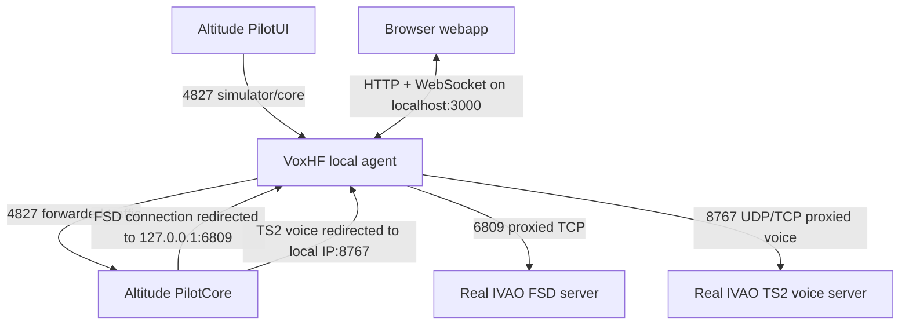
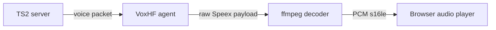
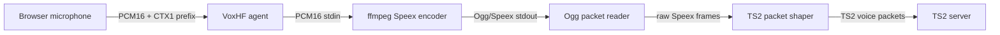
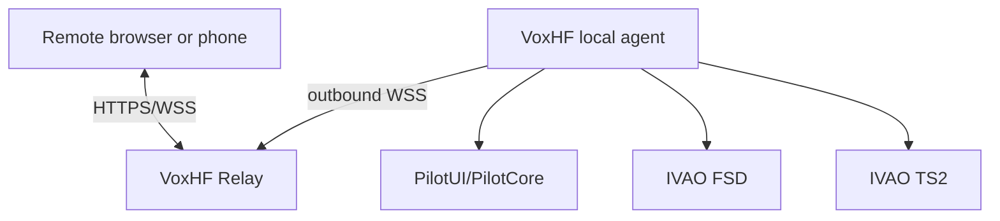

# VoxHF Technical Paper

Version: 0.1.0  
Status: first draft  
Date: 2026-06-27

## Abstract

VoxHF is a local companion for IVAO Altitude. It places a local proxy between
Altitude PilotUI, PilotCore, the IVAO FSD network connection, and the TS2 voice
connection. The proxy keeps Altitude in the normal control path, but observes
and reshapes selected traffic so a browser webapp can provide radio controls,
text messaging, transponder controls, voice receive, and browser microphone
transmit.

The project started as a local-only tool and now includes a Remote Preview
architecture. In Remote Preview, the user's PC still runs the local VoxHF
agent next to Altitude, while a self-hosted relay lets a paired browser on
another network control that local agent through HTTPS/WSS. The local proxy is
never intended to be exposed directly to the public internet.

This paper describes the project architecture, traffic flow, voice pipeline,
remote relay design, security and privacy boundaries, implementation techniques,
current limitations, and future engineering direction.

## 1. Project Goals

VoxHF has four practical goals:

1. Provide a cleaner browser-based radio, chat, and voice surface for IVAO
   Altitude.
2. Keep PilotUI, PilotCore, FSD, and TS2 traffic local to the user's PC.
3. Add remote control without exposing simulator, FSD, TS2, or PilotCore ports
   directly to the internet.
4. Keep the implementation auditable, self-hostable, and explicit about what is
   experimental.

The project is intentionally not an Altitude replacement. It depends on
Altitude and PilotCore for the actual IVAO session. VoxHF acts as a local
bridge and user interface layer.

## 2. Glossary

- **PilotUI**: the Altitude user interface process.
- **PilotCore**: the Altitude core process that owns the simulator/network
  integration.
- **FSD**: IVAO's text/data server protocol used for connection, chat,
  weather, flight plan, station, and position-related data.
- **TS2**: the TeamSpeak 2 based voice transport used by IVAO voice.
- **Local agent**: the VoxHF proxy running on the same PC as Altitude.
- **Webapp**: the browser UI served locally by the agent or statically by a
  self-hosted remote stack.
- **Relay**: the optional WSS service used by Remote Preview.
- **Remote Preview**: the current experimental remote control mode.

## 3. Local Architecture

VoxHF's local mode is the safest default. Everything runs on the user's PC or
local network, and the browser connects to the local webapp served by the
proxy.



The core idea is simple:

1. PilotUI is configured to use the local IPv4 address printed by VoxHF as
   its simulator address.
2. PilotUI connects to VoxHF instead of directly to PilotCore.
3. VoxHF forwards PilotUI/PilotCore traffic so the normal Altitude flow
   remains intact.
4. When PilotCore receives IVAO server information, VoxHF rewrites the
   relevant endpoints so FSD and TS2 traffic pass through the local proxy.
5. VoxHF parses only the traffic needed for the webapp and forwards the
   original session to the real IVAO servers.

## 4. Main Runtime Components

### 4.1 `proxy.js`

`proxy.js` is the local agent bootstrap. It reads configuration, creates the
runtime modules, wires callbacks between them, starts the local listeners, and
prints startup guidance. The protocol-heavy work is intentionally split into
focused modules:

- `proxy/pilot-bridge.js`: PilotUI/PilotCore proxying on the simulator/core
  port, FSD host rewrite, COM state learning, and synthetic PilotUI TX feedback.
- `proxy/fsd-proxy.js`: FSD TCP proxying on `127.0.0.1:6809`, parsed
  chat/weather/ATIS/flight-plan events, and VOICE host rewrite.
- `proxy/ts2-voice-proxy.js`: TS2 TCP/UDP proxying on `0.0.0.0:8767` and RX
  voice decoding side-tap for the browser.
- `proxy/web-tx.js`: browser microphone encoding, local monitor, TS2 transmit
  packet shaping, and cached Altitude TX session usage.
- `proxy/local-web-server.js`: static local webapp server, `/ws` control
  channel, local origin checks, command dispatch, test tone, and browser RX
  fan-out.
- `proxy/app-state.js`: callsign, connection state, radio state, XPDR state,
  flight-plan state, station snapshots, own position, and recent message
  history.
- `proxy/remote-agent.js`: optional outbound Remote Preview connection to a
  relay.

This keeps the executable entry point simple while making the protocol
boundaries easier to review.

### 4.2 `webapp/app.html`

The operational webapp is a static HTML/CSS/JavaScript application. Public
hosting adds a separate landing page and account page before the workspace. In
local mode it connects to the local agent through `/ws`. In Remote Preview mode
it connects to a relay URL configured through query parameters or
`Settings > Remote`.

The UI provides:

- COM1/COM2 frequency inputs and station dropdowns.
- TX buttons inside each COM card.
- Web TX readiness state.
- XPDR squawk, `STBY`, `ALT`, and IDENT controls.
- Chat tabs for all messages, frequency messages, private messages, and
  per-peer private chats.
- Dot-command autocomplete.
- Settings panels for audio, connection, remote preview, and about.

### 4.3 `apps/relay`

The relay is an optional Node.js WSS service for Remote Preview. It is not a raw
tunnel. It validates message envelopes, checks source/type rules, requires
tokens, enforces origin allowlists, performs browser pairing, and forwards only
allowlisted protocol messages between a paired browser and a selected agent.

### 4.4 `packages/protocol`

The protocol package defines Remote Preview message types and validation rules.
It exists so the browser, relay, and local agent share the same explicit remote
message vocabulary.

## 5. Local Proxy Flow

### 5.1 PilotUI to PilotCore

PilotUI normally talks to PilotCore on a simulator/core port. VoxHF listens
on that port and forwards traffic to PilotCore. This creates an inspection
point without replacing PilotCore.

The proxy observes binary payloads for useful state, such as radio frequency
updates and status payloads. It does not expose this raw stream to remote
browsers.

### 5.2 FSD Redirect and Proxy

When PilotCore receives an IVAO FSD endpoint, VoxHF rewrites the endpoint to
`127.0.0.1`. PilotCore then connects to VoxHF's local FSD proxy, and VoxHF
connects onward to the real IVAO FSD server.

VoxHF parses FSD traffic for:

- Connection and callsign state.
- Public, frequency, broadcast, and private text messages.
- METAR, TAF, and ATIS replies.
- Flight plan status signals.
- ATC station data and voice announcements.
- Own aircraft position when present.
- Transponder state from position updates.

The browser receives parsed events, not raw FSD lines. This keeps the UI stable
and reduces accidental leakage of protocol internals.

### 5.3 TS2 Redirect and Proxy

When IVAO announces a TS2 voice server, VoxHF rewrites the voice server
address to the local network IP selected at startup. PilotCore then sends TS2
voice traffic through VoxHF.

VoxHF forwards TS2 traffic to the real server and inspects the packet class
needed for voice receive and transmit session caching.

## 6. Radio and Station Model

VoxHF maintains current COM1 and COM2 frequencies from multiple sources:

- PilotUI/PilotCore binary commands.
- Framed PilotCore/PilotUI status payloads.
- Webapp radio changes.
- Remote Preview radio commands.

The station list is learned from FSD and voice-related data. Observer stations
ending in `_OBS` are filtered out. `UNICOM - 122.800` is always made available
as a manual selectable option.

When both own-position and station coordinates are available, the webapp sorts
stations by distance. This turns the dropdowns into a practical proximity-based
selection tool rather than a flat list.

## 7. Text and Command Handling

The webapp supports direct message composition and dot commands. Commands such
as `.metar`, `.taf`, `.atis`, `.msg`, `.chat`, COM tuning, squawk, XPDR mode,
and IDENT are parsed in the browser and sent to the agent as typed local
actions.

The local agent translates those actions into the appropriate FSD or
PilotCore-facing operation. In Remote Preview, the browser sends a validated
remote protocol message to the relay, and the local agent performs the same
local operation after receiving that message.

This means remote mode does not create a new raw command channel. It reuses the
same local command functions behind a typed and validated protocol boundary.

## 8. Voice Receive Pipeline

Incoming IVAO voice follows this path:



The agent identifies incoming TS2 voice packets, extracts the voice payload,
and writes it to an ffmpeg decoder process. ffmpeg decodes the audio into raw
PCM, which is streamed to connected browsers through WebSocket binary frames.

The browser schedules the PCM through the Web Audio API. Remote RX uses the
same decoded PCM stream, forwarding it through the relay as live binary frames
to the paired browser.

Current behavior:

- Local RX works in the browser.
- Remote RX has been confirmed through a self-hosted relay, including PC and
  mobile browsers listening at the same time, and from an iPhone over a mobile
  network.
- The relay does not store or replay audio.
- Remote RX currently uses live uncompressed PCM for simplicity and low
  latency.

## 9. Voice Transmit Pipeline

Web TX lets a browser microphone transmit through the existing TS2 session.



The browser captures microphone audio with `getUserMedia` and the Web Audio
API. It resamples the signal to the configured TX sample rate and sends PCM16
frames to the agent. The `CTX1` prefix distinguishes microphone binary frames
from JSON messages on the same WebSocket.

The agent owns the codec step. It starts ffmpeg with fixed arguments and uses
libspeex through ffmpeg. The encoder produces Ogg/Speex output. VoxHF unwraps
Ogg packets, skips header packets, and injects the raw Speex frame data into
TS2-shaped voice packets.

The current working TX profile is:

```text
Sample rate: 8000 Hz
Speex quality: 10
Frames per packet: 5
TS2 packet size: 325 bytes
Payload: 0x05 + 308 Speex bytes
Packet interval: configured in config.json
```

The agent derives the TS2 transmit-session seed from observed login and
voice-session traffic, then refreshes it across channel and voice-server
changes. A physical Altitude PTT press is no longer required, although this
observed private protocol remains part of live regression testing.

## 10. Remote Preview Architecture

Remote Preview keeps the sensitive proxy on the user's PC and uses only
outbound connections from the local agent to the relay.



The intended product model is one local agent per user, attached to one
Altitude/simulator session, and multiple browser devices controlling that same
agent.

### 10.1 Pairing Flow

1. The user starts VoxHF on the Altitude PC.
2. The local agent connects outbound with `source=agent` and authenticates the
   WebSocket upgrade through an HTTP `Authorization: Bearer` header.
3. The agent announces itself with `agent.hello`.
4. The relay issues a short-lived pairing code.
5. The user opens the remote webapp from a browser or phone.
6. The browser connects to the relay with `source=browser`.
7. The browser submits the pairing code.
8. The relay stores a preview authorization for that browser and agent.
9. Commands can now flow browser -> relay -> agent.
10. State updates can flow agent -> relay -> browser.

Pairing persistence stores hashed browser identifiers plus agent ids. SQLite
relay modes can list and revoke those pairings from `/admin`; `env` mode keeps
the simpler JSON store. Account mode adds persistent browser sessions,
per-user agent tokens, device management, and administrative revocation. The
simpler `env` mode retains the manual-token and pairing flow. Broader login,
session, and authorization audit coverage remains future hardening work.

### 10.2 Remote Message Protocol

Every JSON message uses the same envelope:

```json
{
  "v": 1,
  "id": "message-1",
  "type": "radio.set",
  "payload": {
    "com": 1,
    "freq": "128.350"
  }
}
```

The protocol rejects:

- Unknown message types.
- Unexpected payload fields.
- Invalid source/type combinations.
- Oversized JSON payloads.
- Frequencies outside the normal VHF COM range.

Remote mode intentionally does not define a generic raw FSD, TS2, or PilotCore
tunnel.

### 10.3 Remote Audio

Remote RX:

- Agent decodes TS2 voice to PCM.
- Agent sends live binary PCM frames to the relay.
- Relay forwards them only to browsers paired with and watching that agent.
- Browser plays the PCM through Web Audio.

Remote TX:

- Browser sends `tx.start`.
- Relay records that this browser has an active TX session for the selected
  agent.
- Browser sends microphone PCM frames prefixed with `CTX1`.
- Relay strips `CTX1` and forwards only the raw PCM to the selected agent.
- Agent feeds the PCM into the same local Web TX encoder and TS2 packet shaper.
- Browser sends `tx.stop`, or the relay/agent stops TX on timeout, disconnect,
  device switch, or revocation.

Remote TX is implemented as preview routing and is covered by automated
browser/relay/agent binary forwarding tests. Live IVAO intelligibility has also
been confirmed by another listener, but broader validation across more
networks, browsers, and listeners is still required because IVAO does not echo
the user's own transmitted audio.

## 11. Security Model

VoxHF uses defense in depth:

- The local agent is not exposed publicly.
- Remote access uses WSS through a relay.
- The relay requires a token.
- Browser origins are allowlisted.
- Browser commands must be paired to a selected agent.
- Remote messages are typed and validated.
- The local agent applies an additional command rate limit before touching
  PilotCore or FSD.
- Audio is live-only and is never intentionally stored by the relay.
- TX audio is accepted only inside a `tx.start` / `tx.stop` session window.
- TX audio frames require the `CTX1` prefix.
- The relay enforces frame size and maximum TX duration limits for live audio.
- TX stops on disconnect, pairing revocation, device switch, or timeout.

The relay is deliberately not designed as a raw tunnel. This reduces the risk
that a browser can send arbitrary protocol bytes to IVAO-facing components.

## 12. Privacy Model

VoxHF handles data that can be sensitive:

- Callsign.
- Chat messages.
- Frequencies and station choices.
- Position-derived station sorting.
- Microphone audio.
- Received voice audio.
- Relay tokens and pairing codes.

Privacy choices in the current design:

- The local proxy does not store chat history across full restarts.
- The relay does not store chat or audio.
- Remote audio is live-only.
- Logs avoid raw FSD/TS2 packets, audio payloads, complete tokens, and chat
  contents.
- Pairing codes are short-lived.
- Registration codes are one-use, in-memory, and time-limited.
- Browser pairings can be revoked.
- Session IP/user-agent metadata and audit persistence are opt-in.

For a production hosted relay, user accounts, device records, deletion flows,
retention policies for audit events, and privacy notices would need to be
formalized before broad public use.

## 13. Technology Stack

### Runtime

- Node.js 20 or newer.
- Native Node TCP, UDP, HTTP, and process APIs.
- `ws` for WebSocket server/client support.

### Audio

- Browser `getUserMedia` for microphone capture.
- Browser Web Audio API for RX playback and microphone processing.
- ffmpeg for Speex decoding and encoding.
- Ogg packet parsing in JavaScript to extract raw Speex encoder packets.

### Webapp

- Static HTML/CSS/JavaScript.
- No frontend build step.
- Local WebSocket for local mode.
- Remote WSS connection for Remote Preview.

### Remote and Self-Hosting

- Node.js relay service.
- Docker Compose preview stack.
- Caddy reverse proxy for HTTPS/WSS and automatic certificates.
- Environment-file based deployment configuration.

### Verification

- `npm run verify` for local project validation.
- `npm run remote:test` for relay/agent/browser simulation.
- GitHub Actions on Windows and Linux for basic CI.

## 14. Verification Strategy

The current automated checks cover syntax, configuration shape, protocol rules,
privacy guardrails, and remote relay behavior.

The Remote Preview simulation starts a real relay on a temporary localhost port
and simulates:

- Token and CORS checks.
- Invalid token rejection.
- Blocked origin rejection.
- Agent connection.
- Browser connection.
- Pairing code flow.
- Browser commands blocked before pairing.
- Allowlisted command routing after pairing.
- Agent update routing to the selected browser.
- Remote RX binary forwarding.
- Remote TX binary forwarding.
- Browser-side revocation.

Manual checks are still required for:

- Real Altitude/PilotCore behavior.
- Real IVAO FSD behavior.
- Real TS2 voice behavior.
- Web TX intelligibility with another listener.
- Remote TX intelligibility over a public relay.

## 15. Current Limitations

- Web TX may have slight crackle compared with native Altitude TX.
- IVAO does not echo the user's own TX audio.
- Remote TX has successful live IVAO validation, but still needs broader
  regression coverage across more networks and listeners.
- Account mode is intended for private self-hosting and still needs broader
  production review.
- Pairings use SQLite in account mode and JSON persistence in simple env mode.
- VoxHF does not currently operate a public hosted account service.
- The responsive mobile interface works, but mobile ergonomics and iOS audio
  routing still need refinement.
- The local proxy should not be exposed directly to the public internet.
- ffmpeg must currently be installed and available to the Node process.

## 16. Future Engineering Direction

Important future work includes:

- Further mobile ergonomics and iOS audio-route refinements.
- Clearer paired-browser management and revocation UI.
- Broader audit logging for login/session events, authorization failures,
  abnormal closes, and production command authorization.
- Better first-run setup flow for Altitude.
- More complete audio diagnostics.
- Keeping the local proxy modules small as Remote Preview, account handling,
  and audio validation evolve.
- Revisiting remote audio compression if bandwidth or relay scale requires it.
- Expanding integration tests around startup, reconnect, and standby recovery.

## 17. Conclusion

VoxHF is a local-first bridge that turns Altitude traffic into a browser
control surface without replacing Altitude. Its main engineering constraint is
that all sensitive IVAO-facing work should remain on the user's PC. The Remote
Preview extends that model by adding a relay that forwards typed, validated,
paired messages and live audio frames without exposing local simulator or IVAO
ports directly to the internet.

The result is a practical experimental architecture: local and remote control,
RX, TX, account access, and self-hosting work today. The remaining work is
mostly about hardening, broader live validation, mobile refinement, and release
ergonomics.
